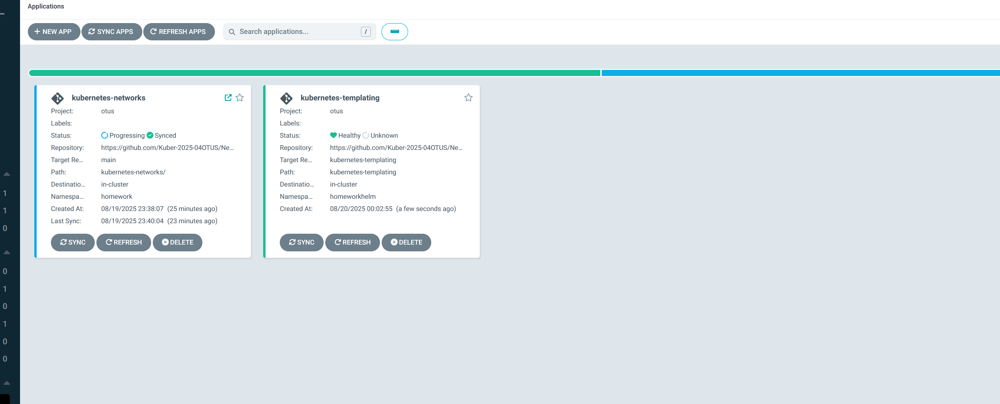
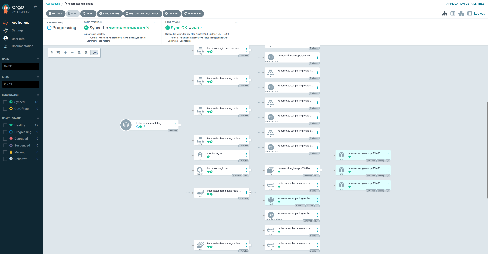
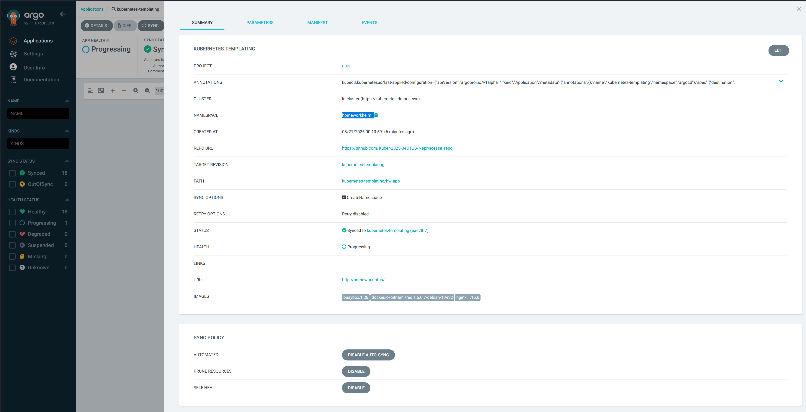
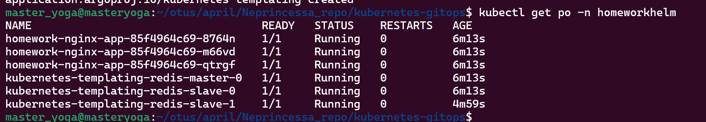

# Установка argocd 
helm repo add argo https://argoproj.github.io/argo-helm
helm repo update
helm search repo bitnami
helm pull  bitnami/argo-cd --version 6.2.2

helm install argo-cd ./argo-cd -f ./argo-cd/my_values.yaml -n argocd

Для входа в веб-интерфейс используем логин: "admin" и пароль: `kubectl -n argocd get secret argocd-secret -o jsonpath="{.data.clearPassword}" | base64 -d)`

Делаем `kubectl port-forward -n argocd service/argo-cd-server 8080:80`

# Задание kubernetes-network
Добавляем приложение `kubectl apply -f network_app.yaml`

И проверяем работоспособность в argocd: 

И непосредственно в кластере: 

# Задание kubernetes-templating

Добавляем второе приложение `kubectl apply -f template_app.yaml`  
Проверка работоспособности: 
 

Деплоится в отдельный нс 

