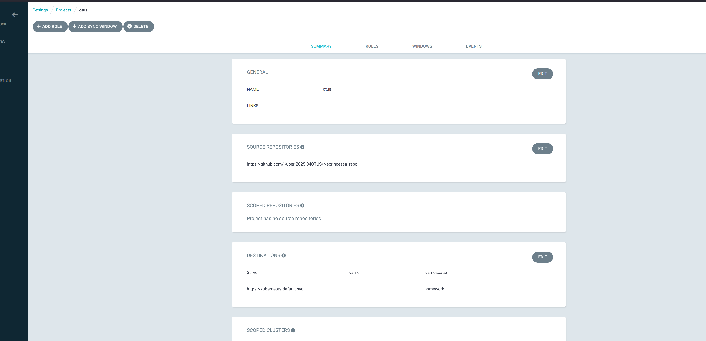
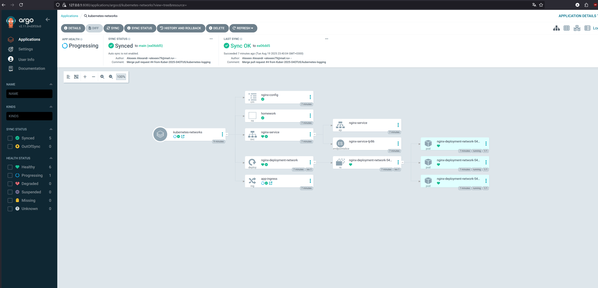
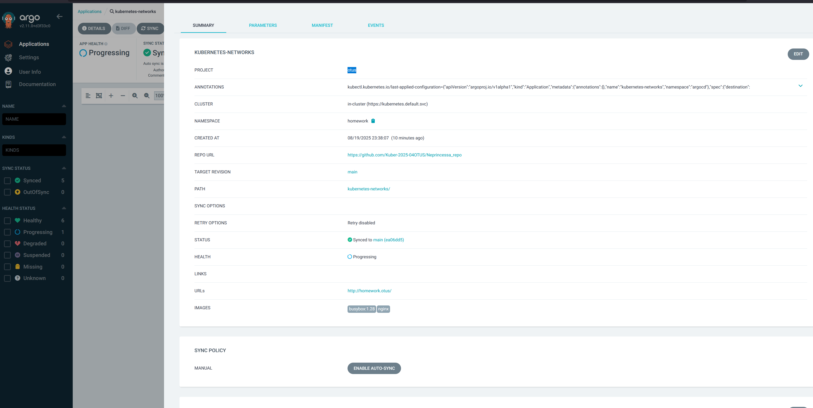
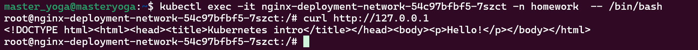

# Установка argocd 
helm repo add argo https://argoproj.github.io/argo-helm
helm repo update
 helm search repo bitnami
 helm pull  bitnami/argo-cd --version 6.2.2

  helm install argo-cd ./argo-cd -f ./argo-cd/my_values.yaml -n argocd
  
** Please be patient while the chart is being deployed **

1. Access your Argo CD installation:
  Execute the following commands:

  kubectl port-forward --namespace argocd svc/argo-cd-server 8080:80 &
  export URL=http://127.0.0.1:8080/
  echo "Argo CD URL: http://127.0.0.1:8080/"

2. Execute the following commands to obtain the Argo CD credentials:

  echo "Username: \"admin\""
  echo "Password: $(kubectl -n argocd get secret argocd-secret -o jsonpath="{.data.clearPassword}" | base64 -d)"

WARNING: There are "resources" sections in the chart not set. Using "resourcesPreset" is not recommended for production. For production installations, please set the following values according to your workload needs:
  - controller.resources
  - repoServer.resources
  - server.resources
+info https://kubernetes.io/docs/concepts/configuration/manage-resources-containers/
kubectl port-forward -n argocd service/argo-cd-server 8080:80

# Задание kubernetes-network

