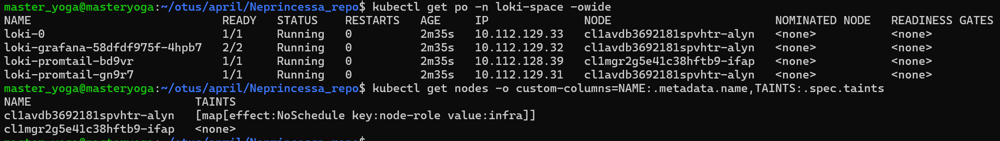
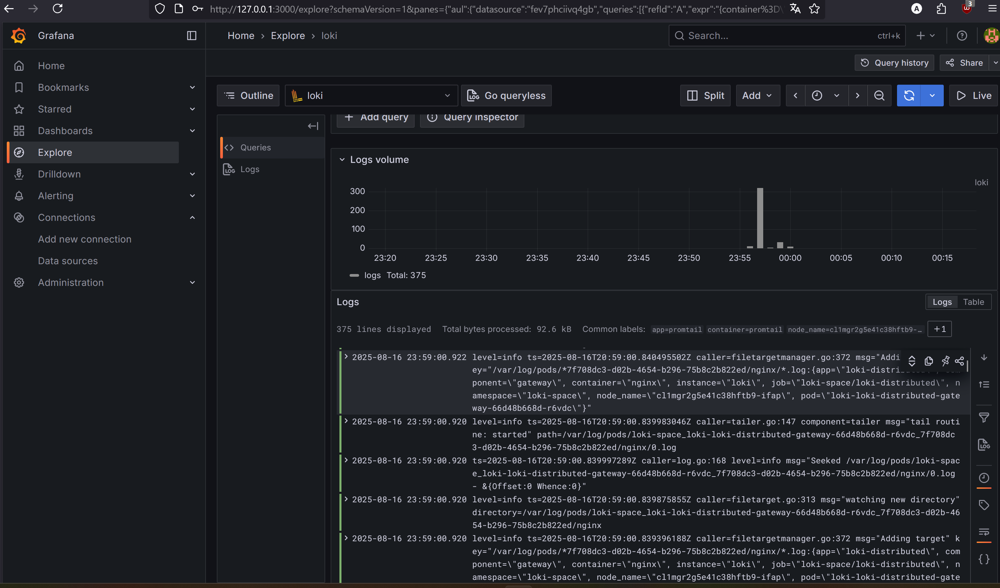

# Общая составляющая. Скачаем официальные чарты.

```
helm repo add grafana https://grafana.github.io/helm-charts
helm search repo grafana
```

## Loki
Из указанного списка подходит loki-stack, так как есть возможность поставить loki, grafana, promtail 

```
helm pull grafana/loki-distributed --version 0.80.5
```

задаём вельюсы и выполняем установку 
`helm install loki -n loki-space ./loki-distributed -f ./kubernetes-logging/loki_values.yaml`
и так же посмотрим ноды `kubectl get nodes -o custom-columns=NAME:.metadata.name,TAINTS:.spec.taints`



# Настройка Grafana

Установка:
```
helm install grafana -n loki-space ./grafana -f kubernetes-logging/loki_values.yaml
```

Получение кред и прокидывание доступа до интерфейса:
```
kubectl get secret --namespace loki-space loki-grafana -o jsonpath="{.data.admin-password}" | base64 --decode ; echo
kubectl get secret --namespace loki-space loki-grafana -o jsonpath="{.data.admin-user}" | base64 --decode ; echo 
kubectl port-forward -n loki-space service/loki-grafana 3000:80
```

## Promtail 

Установка
```
helm pull grafana/promtail --version 6.16.0
helm install promtail -n loki-space ./promtail -f ./promtail/values.yaml
```

# Проверка работоспособности конечной схемы
