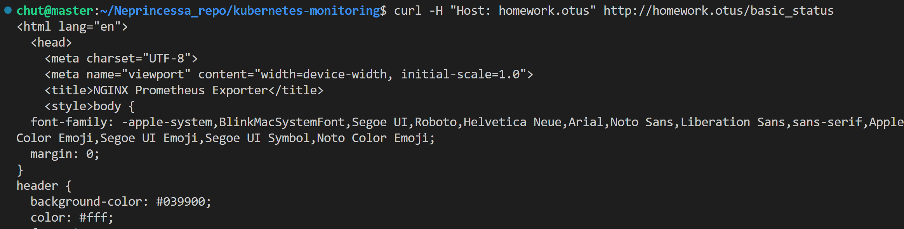
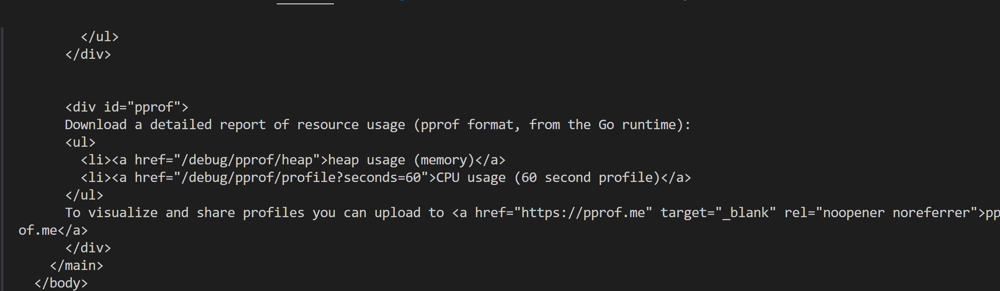
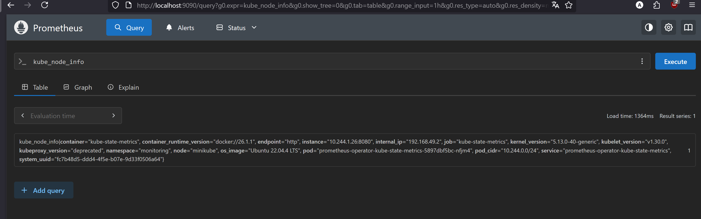
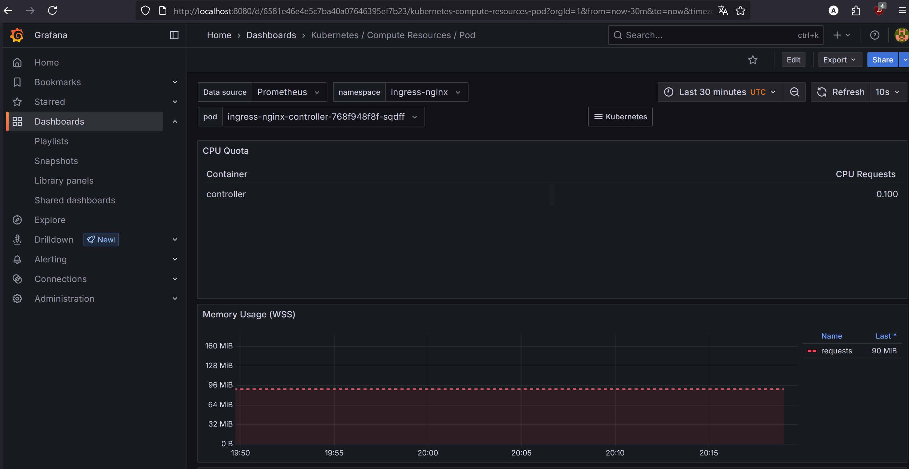

# Задание 

- Необходимо создать кастомный образ nginx, отдающий свои метрики на определённом endpoint (пример из офф документации в разделе ссылок)
- Установить в кластер prometheus-operator любым удобным вам способом (рекомендуется ставить или по ссылке из офф документации, либо через helm-чарт)
- Создать deployment запускающий ваш кастомный nginx образ и service для него
- Настроить запуск nginx prometheus exporter (отдельным подом или в составе пода с nginx - не принципиально) и сконфигурировать его для сбора метрик с nginx
- Создать манифест serviceMonitor, описывающий сбор метрик с подов, которые вы создали

## Работоспособность приложения




## Установка prometheus operator 

```
helm repo add prometheus-community https://prometheus-community.github.io/helm-charts
helm install prometheus-operator prometheus-community/kube-prometheus-stack   --namespace monitoring --create-namespace
```

## Проверка работоспобности

```
kubectl port-forward svc/prometheus-operated 9090 -n monitoring
ssh -L 9090:localhost:9090 chut@158.160.188.185
kubectl port-forward svc/prometheus-operator-grafana -n monitoring 8080:80
ssh -L 8080:localhost:8080 chut@158.160.188.185
```

Смотрим метрики в prometheus


Смотрим метрики в grafana
 
