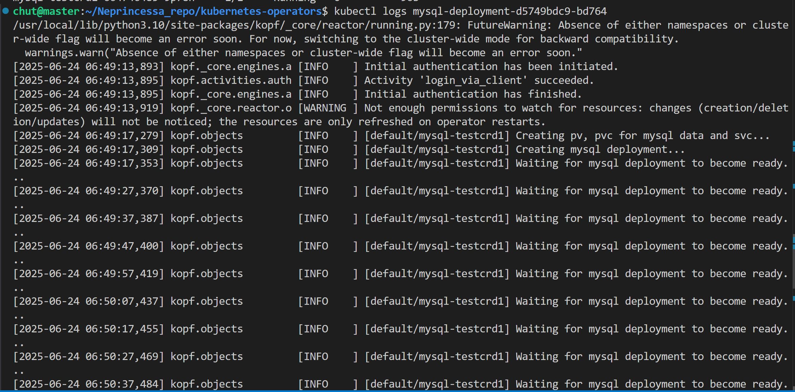
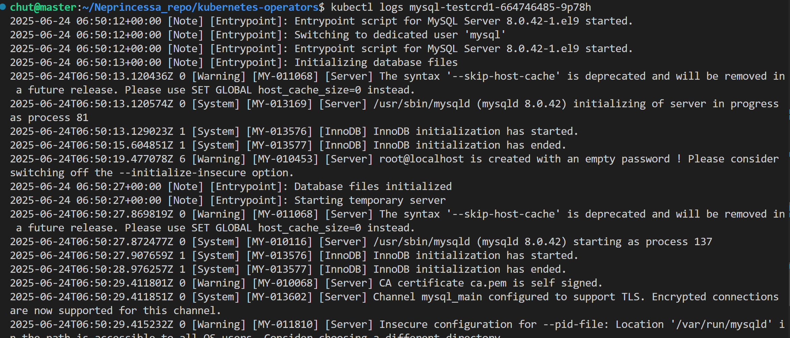
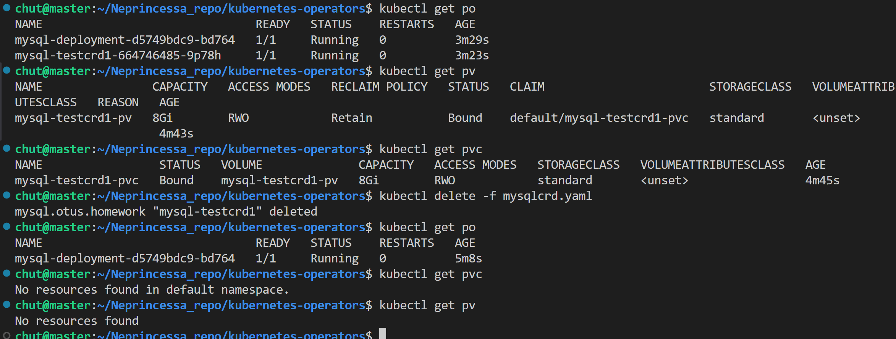
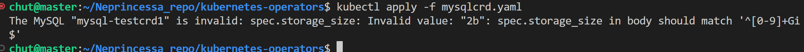

# Задание 1

create resources:

```
kubectl apply -f sa.yaml -f clusterrole.yaml -f crb.yaml -f crd.yaml 
kubectl apply -f deployment.yaml 
kubectl apply -f mysqlcrd.yaml
```

## Проверка работоспособности

- для оператора 



- для crd


## Удаление ресурсов

Видно, что были ресурсы, включая pv,pvc и при удалении mysql crd удаляется всё



## проверка валидности паттерна
если указать некорректное значение в размере, то выдаёт ошибку 




# For Test
kubectl delete -f mysqlcrd.yaml
kubectl delete -f deployment.yaml 
kubectl delete -f sa.yaml -f clusterrole.yaml -f crb.yaml -f crd.yaml 