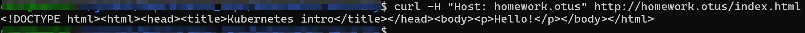
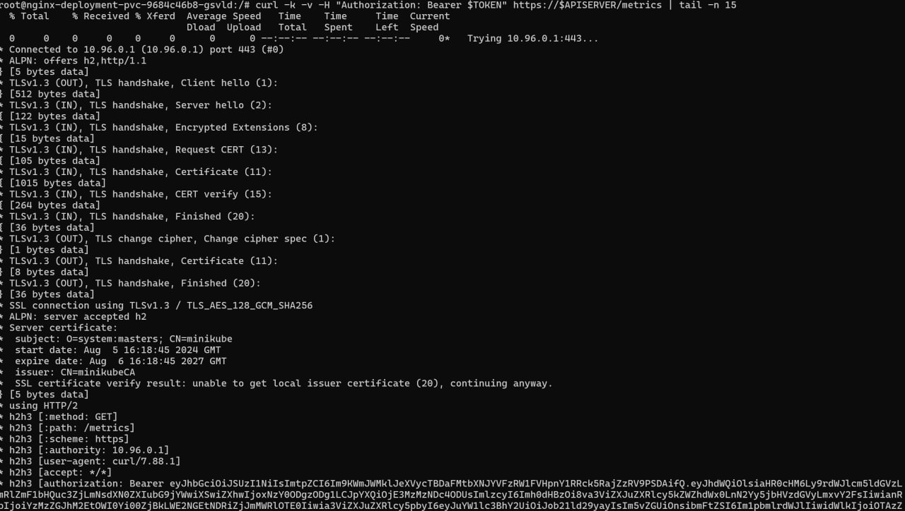
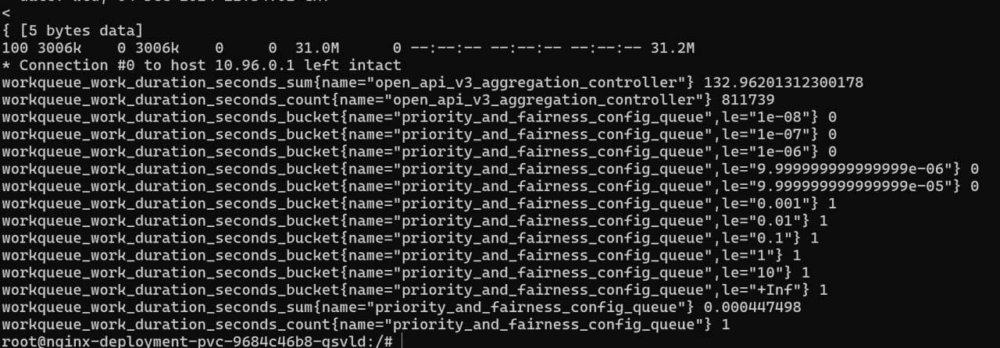

# Домашнее задание №5

- В namespace homework создать service account monitoring и дать ему доступ к эндпоинту /metrics вашего кластера
- Изменить манифест deployment из прошлых ДЗ так, чтобы поды запускались под service account monitoring
- В namespace homework создать service account с именем cd и дать ему роль admin в рамках namespace homework
- Создать kubeconfig для service account cd
- Сгенерировать для service account cd токен с временем действия 1 день и сохранить его в файл token

# Ход работы

# Как запустить проект 

- выполнить `kubectl apply -f cm.yaml -f sa-monitoring.yaml -f clusterrole-monitoring.yaml -f clusterrolebinding-monitoring.yaml -f storage-class.yaml -f pv.yaml -f pvc_custom.yaml -f deployment.yaml -f service.yaml -f ingress.yaml -n homework`
- выполнить `kubectl apply -f sa-cd.yaml -f role-cd.yaml -f rolebinding-cd.yaml -n homework`
- автоматически не создается токен для serviceaccount, поэтому выполнить `kubectl apply -f cd-secret.yaml`. 
- сгенерировать kubeconfig: 

```
clusterName=minikube
namespace=homework
kubectl get sa -n homework
serviceAccount=cd-sa
kubectl config view --minify --raw -o jsonpath='{.clusters[].cluster.server}' | sed 's/"//'
server=${kubectl config view --minify --raw -o jsonpath='{.clusters[].cluster.server}' | sed 's/"//'}
kubectl config view --minify --raw -o jsonpath='{.clusters[].cluster.server}' | sed 's/"//'
server=https://192.168.49.2:8443
kubectl --namespace $namespace get serviceAccount $serviceAccount -o jsonpath='{.secrets[0].name}'
secretName=$(kubectl --namespace $namespace get serviceAccount $serviceAccount -o jsonpath='{.secrets[0].name}')
kubectl --namespace $namespace get secret/$secretName -o jsonpath='{.data.ca\.crt}'
ca=$(kubectl --namespace $namespace get secret/$secretName -o jsonpath='{.data.ca\.crt}')
kubectl --namespace $namespace get secret/$secretName -o jsonpath='{.data.token}' | base64 --decode
token=$(kubectl --namespace $namespace get secret/$secretName -o jsonpath='{.data.token}' | base64 --decode)
echo "
---
apiVersion: v1
kind: Config
clusters:
  - name: ${clusterName}
    cluster:
      certificate-authority-data: ${ca}
      server: ${server}
contexts:
  - name: ${serviceAccount}@${clusterName}
    context:
      cluster: ${clusterName}
      namespace: ${namespace}
      user: ${serviceAccount}
users:
  - name: ${serviceAccount}
    user:
      token: ${token}
current-context: ${serviceAccount}@${clusterName}
" >> sa-cd-config.yaml
```

- сгенерировать токен с ограниченным временем жизни для sa cd `kubectl create token cd-sa -n homework --duration=24h`

# Проверка работоспособности 

- проверка работоспособности в целом: `curl -H "Host: homework.otus" http://homework.otus/index.html`

- проверка ssrviceaccount, который имеет доступ к /metrics 

```
kubectl exec -it <podname> -n homework -- /bin/bash
export APISERVER=${KUBERNETES_SERVICE_HOST}:${KUBERNETES_SERVICE_PORT_HTTPS}
export SERVICEACCOUNT=/var/run/secrets/kubernetes.io/serviceaccount
export NAMESPACE=$(cat ${SERVICEACCOUNT}/namespace)
export TOKEN=$(cat ${SERVICEACCOUNT}/token)
curl -k -v -H "Authorization: Bearer $TOKEN" https://$APISERVER/metrics | tail -n 15
```





- проверка serviceaccount, что с данным sa доступ есть только до определенного нс

```
kubectl --kubeconfig sa-cd-config.yaml auth can-i get pods -n victim
kubectl --kubeconfig sa-cd-config.yaml auth can-i get pods -n homework
```

