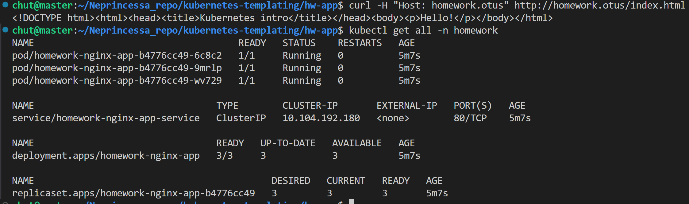
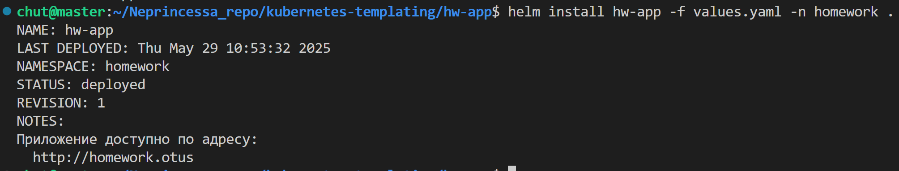
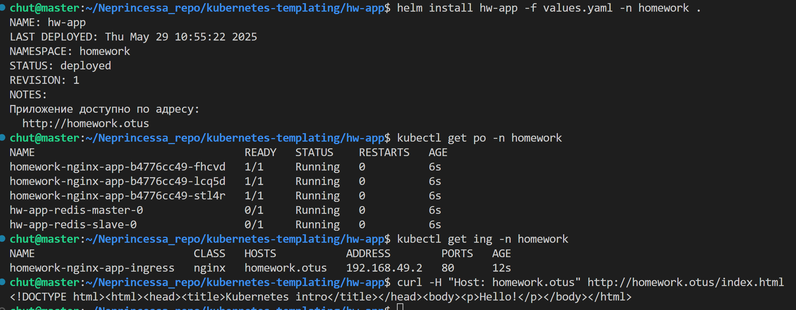

# ДЗ №6

## Задание 1 
Создать helm-chart позволяющий деплоить приложение, которое у вас получилось при выполнении ДЗ 1-5. При этом необходимо учесть: 
    - Основные параметры в манифестах, такие как имена объектов, имена контейнеров, используемых образов, хосты, порты, количество запускаемых реплик должны быть заданы как переменные в шаблонах и конфигурироваться через values.yaml либо через параметры при установке релиза
    - репозиторий и тег образа не должны быть одним параметром 
    - пробы должны быть включаемы/отключаемы через конфиг
    - в notes должно быть описание сообщение после установки релиза, отображающее адрес, по которому можно обратиться к сервису 
    - при именовании объектов в шаблонах старайтесь придерживаться best practice из лекции
    - добавьте в свой чарт сервис-зависимость из доступных community-чартов. Например, mysql или redis

helm create hw-app

# Переделать в нс номеворк

elm repo add bitnami https://charts.bitnami.com/bitnami
 1985  helm repo add stable https://charts.helm.sh/stable
 1986  helm dependency build .
 1987  helm repo add bitnami https://charts.bitnami.com/bitnami
 1988  helm dependency build .
 1989  helm dependency --help
 1990  helm dependency build .

helm pull oci://registry-1.docker.io/bitnamicharts/kafka
helm install my-release oci://registry-1.docker.io/bitnamicharts/kafka -f kubernetes-templating/kafka/values-dev.yaml 

резолвится в приложении !!! 

готово 

полностью задание 1
