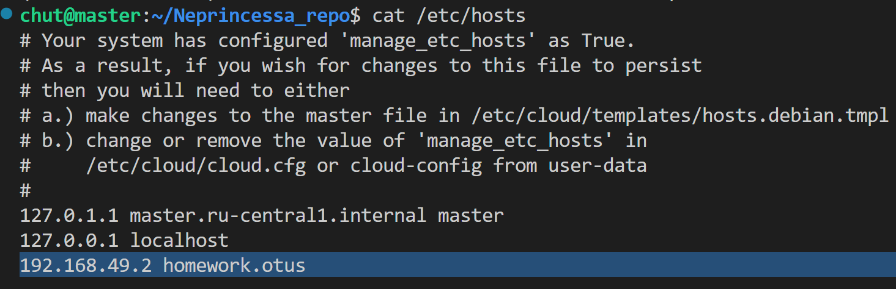
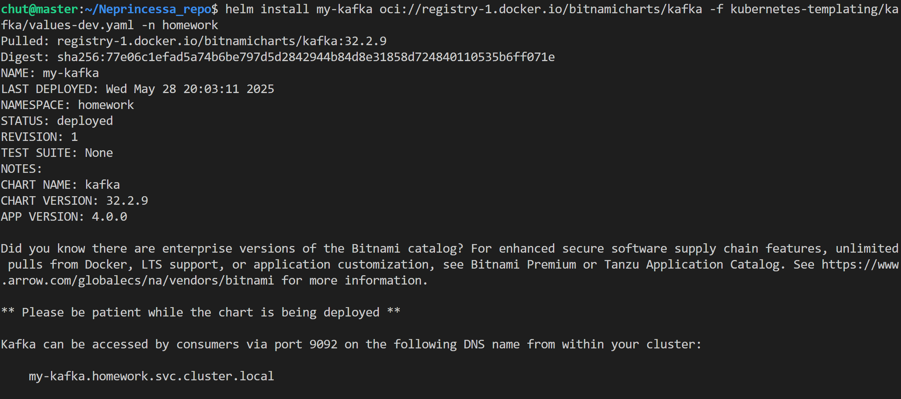
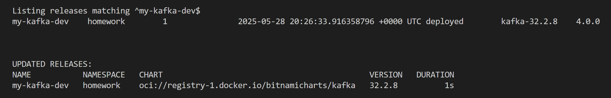
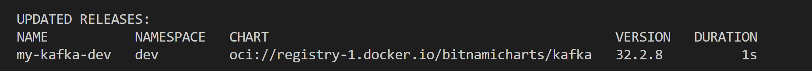
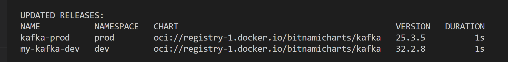
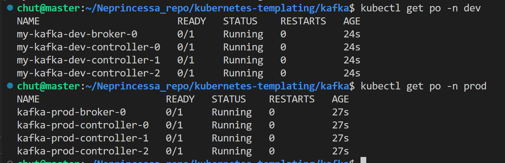

# ДЗ №6

## Задание 1 
Создать helm-chart позволяющий деплоить приложение, которое у вас получилось при выполнении ДЗ 1-5. При этом необходимо учесть: 

    - Основные параметры в манифестах, такие как имена объектов, имена контейнеров, используемых образов, хосты, порты, количество запускаемых реплик должны быть заданы как переменные в шаблонах и конфигурироваться через values.yaml либо через параметры при установке релиза
    - репозиторий и тег образа не должны быть одним параметром 
    - пробы должны быть включаемы/отключаемы через конфиг
    - в notes должно быть описание сообщение после установки релиза, отображающее адрес, по которому можно обратиться к сервису 
    - при именовании объектов в шаблонах старайтесь придерживаться best practice из лекции
    - добавьте в свой чарт сервис-зависимость из доступных community-чартов. Например, mysql или redis

### Ход работы 

Для начала надо переделать всё на чарты. Для начала надо сгенерировать шаблоны, которые потом уже будут адаптированы под текущее приложение: `helm create hw-app`.

Теперь надо добавить зависимость, а именно redis. 

`helm repo add stable https://charts.helm.sh/stable` - добавим репо

`helm dependency build .` - теперь необходимо сбилдить зависимости

### Проверка работоспособности 

```
kubectl get po -n homework 
kubectl get ing -n homework 
curl -H "Host: homework.otus" http://homework.otus/index.html
```


Важно, что адрес ингресса надо записать в /etc/hosts



Проверим, что примонтированный сервис аккаунт имеет доступ до /metrics 


## Задание 2

- Установить kafka из bitnami helm-чарта. Релиз должен иметь следующие параметры:
    - Установлен в namespace prod
    - должно быть развернуто 5 брокеров 
    - должна быть установлена версия kafka версии 3.5.2
    - для клиентских и межрокерных взаимодействий должен использоваться протокол SASL_PLAINTEXT
- Установить kafka из bitnami helm-чарта. Релиз должен иметь следующие параметры:
    - установлен в namespace dev
    - должен быть развернут 1 брокер
    - должна быть установлена последняя доступная версия kafka 
    - для клиентских и межрокерных взаимодействий должен использоваться протокол PLAINTEXT,авторизация для подключения к кластеру отключена
- Описать 2 предыдущих сценария установки в helmfile, приложить получившийся helmfile.yaml (и иные файлы, если они будут)

### Ход работы 

Для начала надо скачать чарты и посмотреть какие values есть и что можно кастомизировать: `helm pull oci://registry-1.docker.io/bitnamicharts/kafka`. Сохраняется в архив, далее его можно разархивировать и посмотреть values.yaml, на основе которых уже формировать файлики для дева и прода.

Проверим установку кафки: `helm install my-kafka oci://registry-1.docker.io/bitnamicharts/kafka -f kubernetes-templating/kafka/values-dev.yaml -n homework`



Комментарии: 
- heapOpts пришлось поставить, иначе падали поды, не хватало ресурсов
- это чтобы тоже сэкономить ресурсы в миникубе 
persistence:
  enabled: false

Теперь формируем helmfile, указав нужные версии, файлики `helmfile apply -n homework`






### Проверка работоспособности 

не хватает ресурсов на вмке, но в целом всё поднялось

