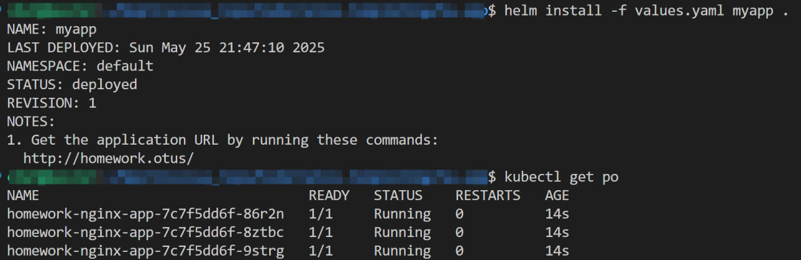
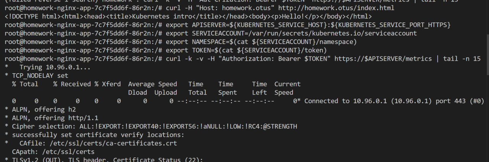
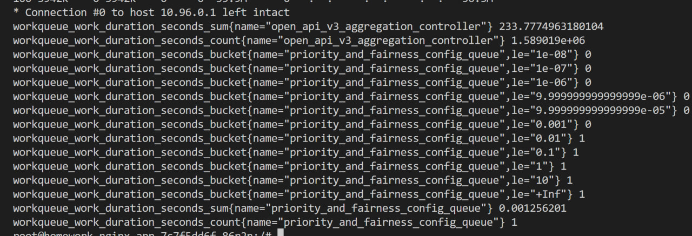
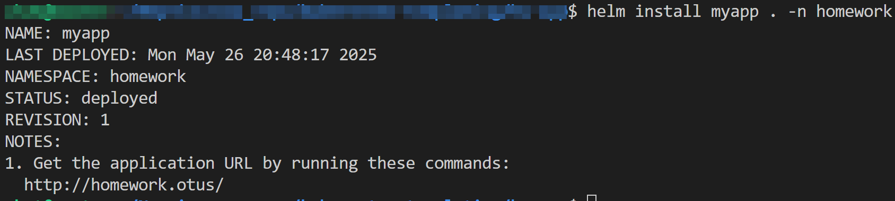
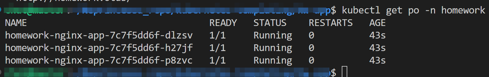

# Задание 1 
helm create hw-app

# Переделать в нс номеворк

elm repo add bitnami https://charts.bitnami.com/bitnami
 1985  helm repo add stable https://charts.helm.sh/stable
 1986  helm dependency build .
 1987  helm repo add bitnami https://charts.bitnami.com/bitnami
 1988  helm dependency build .
 1989  helm dependency --help
 1990  helm dependency build .
